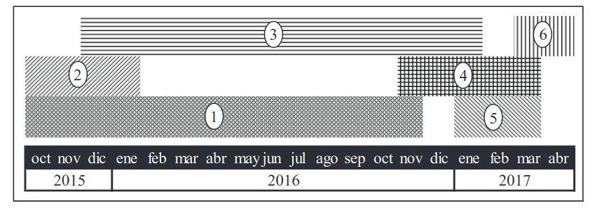
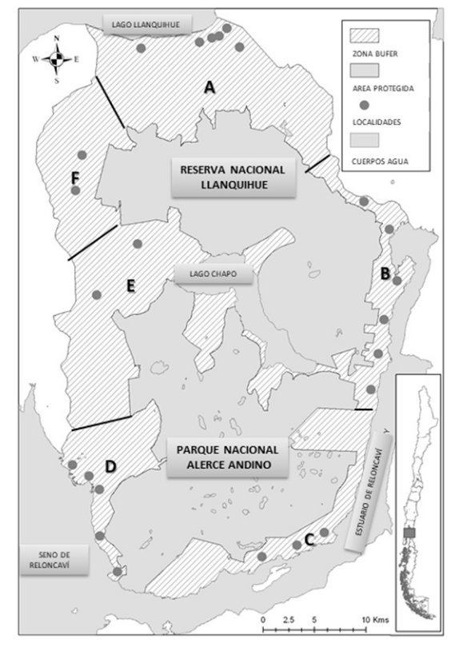

```{r setup, include=FALSE}
knitr::opts_chunk$set(echo = FALSE)
```

### Introduction

Southern Chile...
Los Lagos Region is called because...
this area sustain xx protected areas: xx National Parks, xx National Reserves, and xx others

protected areas as xx and xx area under the supervision of the National Forestry Corporation or CONAF. This entity has the adminstration ...
Currently SNASPE

la integración entre áreas protegidas y comunidades locales no ha demostrado ser del todo exitosa (Brown, 2002).
cuatro de las seis categorías de áreas protegidas de la Unión Internacional para la Conservación de la Naturaleza (UICN) refuerzan la conservación estricta, debido a que al interior de las áreas protegidas sólo está permitido el uso no consuntivo de los recursos naturales (Brown, 2002). Esta situación se ve favorecida pues gran parte de las áreas protegidas se encuentran en lugares remotos y muy distantes de los centros de desarrollo de la sociedad actual (Joppa & Pfaff, 2009) y, por lo tanto, sin mayores vinculaciones con el contexto territorial en que se ubican.

Puyehue national Park PNP
Vicente Perez Rozales National park VPRNP
Alerce Andino national park AANP
lago Llanquihue National Reserve

### Methodology

A systematic review of scientific literature was made searching in the Web of Science. Keywords usead at topic level were: "Puyehue National Park" or "Vicente Perez Rozales National Park" or "Alerce Andino National Park".  resulted in 19 journal articles.


### Hydrology

Spectral characterrization and comparison among lakes in @delosRiosSpectral

### Ecosystem functioning and services

Chusquea fenology in @delaFuenteChusquea
El área de estudio se ubica en el sector de Antillanca (40º78’S y 72º22’O,

```{r BuffferArea}

```

### Socio-ecology

Turism and peoples movement in @SozaAmigoTurism

conection with PNP with thre cities valdivia, Osorno y Puerto Montt (154.716, 147.826, and 220.143 of urban population respectibly, according to 2017 Census, Chile )
The results show that the chang-es in the economic structure had improve the main sectors of the centers, weakening the potential development of the Park. Especially the lacks of connectivity development and the small supply of good and services of the Park are the main constraint that arise from the analysis to increase the number and length of visits. 


Social actors in AANP and LLNR buffer in @mardones_social

The study was focused in the buffer zone of figure \@ref(fig:BufferArea)  
El estudio combina el análisis cualitativo del mapeo de actores (MDA) con el mé-todo cuantitativo del análisis de redes sociales (ARS).
La inves-tigación utiliza una aproximación sociométrica al análisis de redes sociales, el cual se refiere al estudio de las propiedades estructurales de una red, tales como densidad y cohesión (Marín, Gelcich, Castilla, & Berkes, 2012). 
Social studies mention haigh fragmentations of social network according to economic sectors (agriculture, artisal fisheries, turism, among others ). 
Low participation and separation from the protected area which has not incorporated the community 

```{r BuffferArea}

```


### Freshwater biodiversity

### Conservation priorization -Climate change

### References